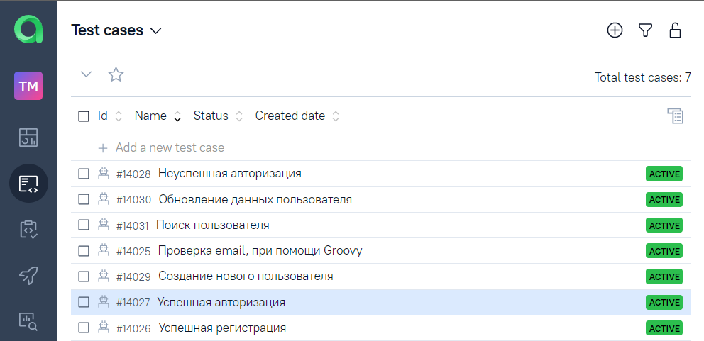

# Дипломный проект по автоматизации тестирования API для [reqres.in](https://reqres.in/)

##	Содержание

- [Технологии и инструменты](#technologist-технологии-и-инструменты)
- [Реализованныe проверки](#bookmark_tabs-реализованные-проверки)
- [Запуск тестов из терминала](#computer-запуск-тестов-из-терминала)
- [Запуск тестов в Jenkins](#-запуск-тестов-в-jenkins)
- [Отчет о результатах тестирования в Allure Report](#-отчет-о-результатах-тестирования-в-Allure-report)
- [Интеграция с Allure TestOps](#-интеграция-с-allure-testops)
- [Уведомления в Telegram с использованием бота](#-уведомления-в-telegram-с-использованием-бота)


## :technologist: Технологии и инструменты
<p  align="center">

<code></code>
<code></code>
<code></code>
<code></code>
<code></code>
<code></code>
<code></code>
<code></code>
<code></code>
<code></code>

</p>

## :bookmark_tabs: Реализованные проверки:

- Проверка email, при помощи Groovy
- Успешная регистрация
- Успешная авторизация
- Неуспешная авторизация
- Создание нового пользователя
- Обновление данных пользователя
- Поиск пользователя

## :computer: Запуск тестов из терминала

### Локальный запуск тестов

```bash
gradle clean test
```

##  Запуск тестов в [Jenkins](https://jenkins.autotests.cloud/job/tmaksyutov_diplom_api/)

Для запуска сборки необходимо нажать кнопку <code><strong>*Собрать*</strong></code>.

<p align="center">
  
</p>

После выполнения сборки, в блоке <code><strong>*История сборок*</strong></code> напротив номера сборки появится
значок *Allure Report*, кликнув по которому, откроется страница с сформированным html-отчетом.

##  Отчет о результатах тестирования в [Allure Report](https://jenkins.autotests.cloud/job/tmaksyutov_diplom_api/allure/)

<p align="center">
  
</p>

<p align="center">
  
</p>

##  Интеграция с [Allure TestOps](https://allure.autotests.cloud/launch/17992)

### Основной дашборд

<p align="center">
  
</p>

### Список тестов с результатами прогона

<p align="center">
  
</p>

### Тест-кейсы

<p align="center">
  
</p>

##  Уведомления в Telegram с использованием бота
После завершения сборки специальный бот, созданный в <code>Telegram</code>, автоматически обрабатывает и отправляет сообщение с отчетом о прогоне тестов.

<p align="center">

